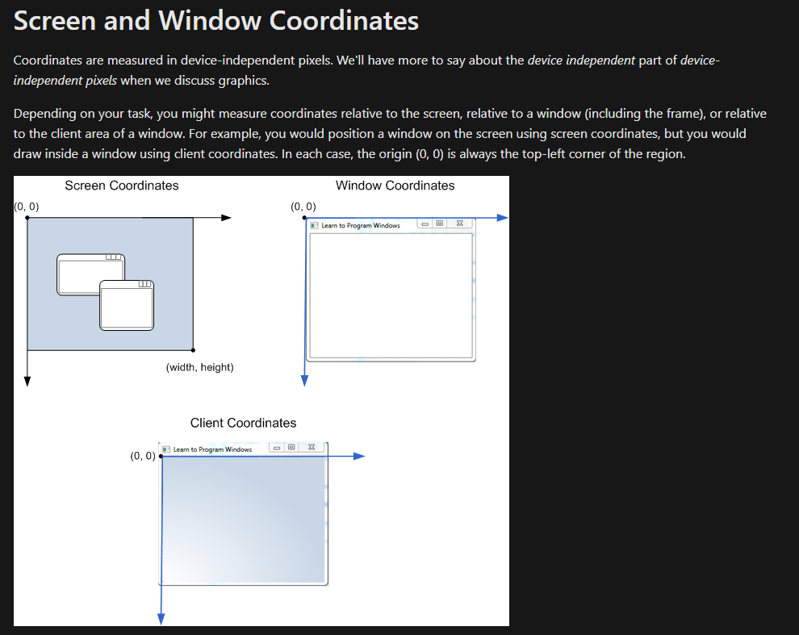
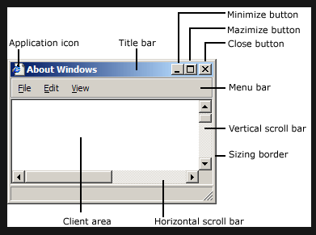

# RuneScape - Artificial Intelligence (RSAI) Bot<a href="#rsai_proj_title_note" id="rsai_proj_title_note_ref">*</a>

[comment]: <> (![slaying_cows_using_obj_dect]&#40;assets/RSAI_JARVIS_Media.gif&#41;)
## Contents

1. [Goal](#goal) 

2. [Old School RuneScape & RuneScape (3)](#osrs_vs_rs3) 

3. [Notable Achievements & Facts](#facts_and_achievements) 

4. [Current Capabilities Demonstrations](#current_capabilities) 

    4.1 [Environmental Interaction Using Object Detection](#env_interaction) 

    4.2 [Simulation Environment GUI Software](#sim_env_gui_sw) 

4. [Autonomous Navigation Problem Potential Solutions & Key Topics](#auto_nav_prob_potential_sols) 

## Goal 

The development of an AI-based video game bot for the Massively Multiplayer Online Role-Playing Game (MMORPG) titled Old School RuneScape, the former redux version of RuneScape (AKA RuneScape 3), developed by the British video game studio, Jagex Limited.

## Old School RuneScape & RuneScape (3) 

Old School RuneScape, originally named RuneScape, is an improved version of the backed up source code of the version of the game from August 2007. It was brought back on the 22nd of February, 2013, after having been temporally taken down so as to make way for RuneScaoe 3, the third and most recent iteration of the game, launched in July in 2013. Despite this latest HTML5-client based version of the game (RuneScape 3) possessing graphical effects and features far more advanced compared to that of Old School RuneScape, it is this earlier version of the game (OSRS) which happens hosts the largest base of players between the two versions<a href="#osrs_rs3_player_base" id="osrs_rs3_player_base_ref">1</a>.

* In-game screenshot comparison of both games. RuneScape3 (left), showing a player carrying a longsword and standing amongst a bunch of NPC wizards, a typical scenario for an experienced player. Old School RuneScape (right), showing a new player in combat with a goblin, a standard activity every newly joined player goes through.*

### Notable Achievements & Facts 

- Guinness World Records award for the ["Most users of an MMO videogame"](https://www.guinnessworldrecords.com/world-records/105537-most-users-of-an-mmo-videogame) with a reported number of over 254,994,744 player accounts having been created since the game was first launched back in 2001.

- Guinness World Records award for the ["Most prolifically updated MMORPG videogame"](https://www.guinnessworldrecords.com/world-records/most-prolifically-updated-mmorpg) reportedly having been updated once a week on average for a total number of updates greater than 1,014 since the games initial launch.

- Guinness World Records award for the ["Greatest aggregate time playing an MMO or MMORPG videogame (all players)"](https://www.guinnessworldrecords.com/world-records/most-popular-free-mmorpg) for having a total aggregate number of minuets of player game time spent exceeding 443 billion, counting as of 27 July 2012.

- An anti-botting system, called "ClusterFlutterer", released in an update on the 25th of October, 2012, under the nickname of "Bot-Nuke", eventually 

lead to the banning of an estimated 98% of all botting accounts, equating approximately to 7.7 million million accounts being banned<a href="#bot_nuke" id="bot_nuke_ref">2</a>.

---

### Current Capabilities Demonstrations 

#### Environmental Interaction Using Object Detection 

Autonomous slaying of cows by the bot with the help of object detection. The TensorFlow pre-trained model which was used was ssd_mobilenet_v1_coco and it was trained on a dataset of images and PASCAL VOC format annotations, created using [LabelImg](https://github.com/tzutalin/labelImg).

* Object detection based autonomous NPC slaying at the cow pen near the in-game city/town called Lumbridge*

 

* Object detection based autonomous resource gathering at the mines south of Lumbridge*

 

#### Simulation Environment GUI Software 

An extensive still-in-development simulation GUI program developed for various purposes. Some of these are:

- Use of as a controllable & deterministic simulation environment.

- Implementation & testing of reinforcement learning algorithms.

- Assistive experimentation tool for autonomous navigation.

- Investigation of various planning & decision making algorithms.

- Validation & verification of implementations prior to integration with the system. 

A great and invaluable piece of contribution to project by [Victor Guillet](https://github.com/vguillet).

* An extensive still-in-development simulation GUI program developped for various purposes. Is currently mainly being used for implementing and testing reinforcement learning algorithms as streamlined and conveniently as possible, in addition to being used as a helpful tool in the quest of solving the problem of autonomous navigation. Credits to [Victor Guillet](https://github.com/vguillet) for his invaluable contribution*

### OSRS Game Client Window & User-Interface Components

* Object detection based autonomous NPC slaying at the cow pen near the in-game city/town called Lumbridge*

---

## Autonomous Navigation Problem Potential Solutions & Key Topics

- Iterative Closest Point (ICP) algorithm

- End-to-end (E2E) Deep Learning (DL)

    - CNN2-LSTM Network

    - [SuperPoint](https://github.com/rpautrat/SuperPoint) network

    - Hierarchical Scene Coordinate network [(hscnet)](https://github.com/AaltoVision/hscnet) for coordinate classification (& regression?) for visual localisation

    - [Hierarchical Localisation](https://github.com/cvg/Hierarchical-Localization) network

- Extended Kalman Filter (EKF)

- Dead Reckoning

- Topological (visual) graphs & maps

- View graphs (& maps)

- Optical flow

- Key points

- Global & local feature descriptors

- Simultaneous Localisation And Mapping (SLAM)

    - Occupancy Grid SLAM

    - GraphSLAM

    - RGB-D SLAM

## Navigation & Simultaneous Localization And Mapping (SLAM)

### Place to Place Navigation (P2PNav)

Flow of steps:

- **Starting Place**: Set starting place (global) Main Map loc coordinates 

- **Along Path/Trajectory**: 

  - 1st) Convert A* generated (global) Main Maps displacements to mini map (mm) screen pixel pos coords.

  - 2nd) Use generated mm screen pixel pos coords for Left Mouse Button actuator clicks. 

---
# Scripts Explained

## Main/Root Dir, `RSAI_JARVIS`
- `settings.py`: This script is reponsible of setting all the necessary settings which will me required and used (in the background) by the various other scripts/modules present in this repo. The general settings in question are:
  - Directory and file paths.
  - The specific mouse & keyboard buttons to be monitored, and their initial states upon initialization.
  - The size/dim (width & height) to resize (& maintain) the game window, and the position
  (x, y)( w/ (0, 0) at the top left of the screen) to position the game window to. Also, the name of the window.

## Testing, `jarvis/tests`

- `jarvis/tests/osrs_api_test.py`: This script is used for testing the Old School Runescape API which allows you to fetch
  real-time market prices of items from the Grand Exchange.
- `jarvis/tests/test_game_client_wndw.py`: This script is used for testing the game client handler. The primary purpose of
  the `GameClient` class is to "take control" of the game client window in order to resize & reposition the game client
  window.
- `jarvis/tests/test_slam.py`: Does not seem to be working.
- `jarvis/tests/test_vision_sys.py`: 
- `jarvis/tests/test_vision_sys_GUI_version.py`: This script is for testing the integration of following modules:
  - Object Detection & Tracking: `Vision`
  - Game Client Handler, `GameClient`
  - GUI: `VisionTestGUIHandler` & `VisionSysHelperUtil`
  - Actuators (Mouse & Keyboard Clicks): `Mouse` & `HardwareEventsListener`
  - The actual agent/bot: `Hobbes`

## Utils, `jarvis/utils`

- `jarvis/utils/vision_sys_helper_util.py`: The `VisionSysHelperUtil` class in this script is a helpful 
utility for the `Vision` & `VisionTestGUIHandler`  modules. Its utilisation purpose is the annotation of infomartion and drawing of "symbols" on the captured screen shots which are displayed in the GUI. All "settings" of this class are `True` by default!
  * `VisionTestGUIHandler` class with (left) all default/True settings and (right) with every thing "switched" off. Note that the script in use (being annotated in the bottom right) is `jarvis/tests/test_vision_sys_GUI_version.py` script.*
- `jarvis/utils/screen_tools.py`: This script contains various implementations of fuctions for the purposes of either manipulating a window (i.e. moving &/or resizing  it), finding a window and getting/returning the so-called "handle" to it etc.... The most important ones to be concerned with (for the time being, 08/08/2021), i.e. the ones which are being and/or should be made use of, in system critical operations, are:
  - `get_client_pos_and_size(wndw_name=settings.GAME_WNDW_NAME) -> "the 4-tuple (x, y, w, h), i.e. (8, 31, 783, 560)":`
  - `get_window_screen_tl_br_coords(win_name): # //TODO: Do V&V`

## Game Client, `jarvis/game_client`, 
- `jarvis/game_client/game_client.py`: This class is reponsible of the managinging & handling of the OSRS game client window. For instance, it allows for the changing of "the position and dimensions of the specified window". Note that "For a top-level window, the position and dimensions are relative to the upper-left corner of the screen." Also, "NOTE (regarding window alignment with true left & true top) "Windows 10 has an invisible border of 7 pixels (Totaling to 8 pixels if you include the visible 1 pixel window border.)"
  - Noteworthy `win32gui` module usages employed:
    - `win32gui.GetWindowRect(hwnd)` 
      - "Retrieves the dimensions of the bounding rectangle of the specified window. The dimensions are given in screen coordinates that are relative to the upper-left corner of the screen." 
      - hwnd: The handle to the window

  
## Vision Sys, `jarvis/vision_sys`
- `jarvis/vision_sys/vision_cls.py`:
- `jarvis/vision_sys/sensor.py`:
- `jarvis/vision_sys/obj_detector.py`:
- `jarvis/vision_sys/obj_tracker.py`:
  

---
## `jarvis_modules_dev` Branch TO-DO'S
- [X] Implement a SINGLE (USE) func in `screen_tools.py` (& a simple test func for it) which DIRECTLY returns the CORRECT client (area) pos. & size, (x, y, w, h) where:
  - x: The x coord of the top left corner of the client (area) **AKA** the x coord of the pnt of origin of the client (area)'s coordinate axes.
  - y: Same as the above, but for the y coord.
  - w: The (pixel) width of the client (area)
  - h: The (pixel) height of the client (area)
- [ ] Refractor the `Vision` cls and its (cls) attrs `Sensor`, `ObjectDetector` & `CentroidTracker` in order to: 
  - Make use of the func implemention mentioned above to be able to get rid of all the confusion caused by varying use cases of roi in each of these classes. 
  - Also refactor `Vision` in order to minimize the external usage of its methods as much as possible.

  
## "Mundane" TO-DO Dev Notes

<ins>Script Documentation  **TO BE ADDED**</ins>

- [ ] `jarvis/tests/test_vision_sys_GUI_version.py`
- [ ] `jarvis/utils/vision_sys_helper_util.py`
- [X] `jarvis/game_client/game_client.py`

<ins>Files **TO BE DELETED**</ins>

- [X]  README_backup.adoc
- [X]  test_vision_sys_GUI_version.spec
- [X]  draft_for_README.md
- [X]  Handbook of Computer Vision Algorithms in Image Algebra.pdf

**INCOMPLETE**

<ins>Folders **TO BE DELETED**</ins>

- [X] bot_sys_components
- [X] build
- [X] dist

**INCOMPLETE**

<ins>JARVIS Folders & Files In Use [X] & Not In Use [_]</ins>

- [ ] jarvis/actuator_sys/actuator.py
- [X] jarvis/actuator_sys/mouse.py
- [X] jarvis/game_client/game_client.py
- [ ] jarvis/hobbes_bot/basic_self_contained_bot_cls.py
- [X] jarvis/hobbes_bot/hobbes.py
- [X] jarvis/hobbes_bot/inventory.py
- [ ] jarvis/hobbes_bot/navigation.py
- [ ] jarvis/hobbes_bot/skills.py
- [ ] jarvis/jarvis_core/agent.py
- [ ] jarvis/jarvis_core/environment.py

---

## Notes on Windows Win32 API & Python Prog.
Sources:
- [About Windows](https://docs.microsoft.com/en-us/windows/win32/winmsg/about-windows#controls-and-dialog-boxes)
- [Python for the Win32 API](http://timgolden.me.uk/pywin32-docs/contents.html)
- [win32gui](http://timgolden.me.uk/pywin32-docs/win32gui.html)
- 

### The "Window" (Application)

When you start the system, it automatically creates the desktop window. The desktop window is a system-defined window that paints the background of the screen and serves as the base for all windows displayed by all applications.

Every graphical Windows-based application creates at least one window, called the main window, that serves as the primary interface between the user and the application.

An application can use the FindWindow function to discover whether a window with the specified class name or window name exists in the system. If such a window exists, `FindWindow` returns a handle to the window. In Python (e.g.):

win32gui.FindWindow(None, win_name) where win_name = Title of window to find, i.e. "Old School RuneScape"

**Position**: A window's position is defined as the coordinates of its upper left corner. These coordinates, sometimes called window coordinates, are always relative to the upper left corner of the screen or, for a child window, the upper left corner of the parent window's client area.

**Size**: A window's size (width and height) is given in pixels.

To perform an operation on a window, you will typically call some function that takes an HWND value as a parameter. For example, to reposition a window on the screen, call the win32gui.MoveWindow(hwnd, x, y, width, height, bRepaint) function in Python (e.g.):

win32gui.MoveWindow(hwnd, x_new, y_new, new_width, new_height, True)

### The "Client" (Area)
The client area is the part of a window where the application displays output, such as text or graphics.

### RECT structure (windef.h)

The RECT structure defines a rectangle by the coordinates of its upper-left and lower-right corners.

"
Well thanks to @ChristopherOicles This is really his answer. Duplicate this as your own (or tweak it, whatever) and I'll accept your's.
What's going on is microsoft wrecking border widths in windows 10.
**GetWindowRect returns the outside window coordinates as screen coordinates**. **GetClientRect returns the inside the window coordinates**. Up until Windows 10 (F U Win10 !!),
**The difference in width and height between them was the width and height of the borders**.
Upon win10, **the border width reports 16 pixels, so 8 pixels a side**. However, **only 1 of those pixels are visible**. **7 of them are transparent**. So your **window has a transparent 7 pixels to the left, right, and bottom**.
So you need to take those transparent 7 pixels into account if you're going to line up the window on the screen programmatically. The user doesn't want that 7 pixel gap next to the screen border !
DwmGetWindowAttribute with the attribute DWMWA_EXTENDED_FRAME_BOUNDS will get you the width and height of the ACTUALLY SHOWING part of the border in screen coordinates. So similar to GetWindowRect, but the rect does not include the invisible-ness.
You're still going to need GetWindowRect most of the time to set the width and height of your window and those 7 pixels per side of invisible-ness are needed to size the window properly programmatically.
So use the difference between the .left of the rect GetWindowRect returns and .left of what DwmTerribleName returns to get that 7 pixels of offset.
In my opinion, whoever did this at Microsoft should be immediately shot. This is a hoop I didn't need to jump through. This breaks compatibility with the past."[windows 10 screen coordinates are offset by 7](https://stackoverflow.com/questions/42473554/windows-10-screen-coordinates-are-offset-by-7)

---

## Acronyms, Abreviations & Terms Used

- "def": "default"
- "w/": "with"
- "w/o": "without"
- "b/c": "because"
- "args": "arguments"
- "params": "parameters"
- "OSRS": "Old School RuneScape"
- "RS3": "RuneScape 3"
- "vis" or "viz: "Vision"
- "h/w": "hardware"
- "pos": "position"
- "coords": "coordinates"
- "dim(s)": "dimension(s)"
- "obj": "object"
- "dect" (yes, dect): "detection"
- "wndw": "window"
- "num": "number"
- "req": "required"
- "V&V" or "VV": "Verification & Validation"
- "sys": "system"
- "windows.h": Is a Windows-specific header file for the C and C++ programming languages which contains declarations for all of the functions in the Windows API, all the common macros used by Windows programmers, and all the data types used by the various functions and subsystems. It defines a very large number of Windows specific functions that can be used in C.

**INCOMPLETE**

---

<a id="rsai_proj_title_note" href="#rsai_proj_title_note_ref">*</a>More accurately, Old School RuneScape Artificial Intelligence, OSRS-AI, Bot

<a href="#osrs_rs3_player_base" id="osrs_rs3_player_base_ref">1</a>[Old School RuneScape Official Wiki Webpage](https://oldschool.runescape.wiki/w/Old_School_RuneScape )

<a id="bot_nuke" href="#bot_nuke_ref">2</a>[Runescape bot nuking event bans 1.5 million bots in one day](https://www.pcgamer.com/runescape-bot-nuking-event-bans-1-5-million-bots-in-one-day/)

 

