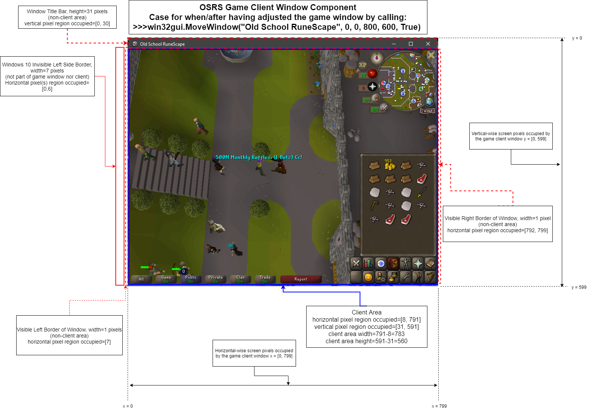

= RuneScape - Artificial Intelligence (RSAI) Bot

:toc:
:toc-title: Table of Contents
== 1) Goal

The development of an AI-based video game bot for the Massively Multiplayer Online Role-Playing Game (MMORPG) titled Old School RuneScape, the former redux version of RuneScape (AKA RuneScape 3), developed by the British video game studio, Jagex Limited.

== 2) Old School RuneScape &amp; RuneScape (3)

Old School RuneScape, originally named RuneScape, is an improved version of the backed up source code of the version of the game from August 2007. It was brought back on the 22nd of February, 2013, after having been temporally taken down so as to make way for RuneScaoe 3, the third and most recent iteration of the game, launched in July in 2013. Despite this latest HTML5-client based version of the game (RuneScape 3) possessing graphical effects and features far more advanced compared to that of Old School RuneScape, it is this earlier version of the game (OSRS) which happens hosts the largest base of players between the two versions!footnote:[https://oldschool.runescape.wiki/w/Old_School_RuneScape[Old School RuneScape]]

image:assets/rs3_vs_osrs_comparison_images_combined.jpg[RuneScape 3 vs Old School RuneScape comparison]* In-game screenshot comparison of both games. RuneScape3 (left), showing a player carrying a longsword and standing amongst a bunch of NPC wizards, a typical scenario for an experienced player. Old School RuneScape (right), showing a new player in combat with a goblin, a standard activity every newly joined player goes through.*

=== 2.1) Notable Achievements & Facts

* Guinness World Records award for the https://www.guinnessworldrecords.com/world-records/105537-most-users-of-an-mmo-videogame["Most users of an MMO videogame"] with a reported number of over 254,994,744 player accounts having been created since the game was first launched back in 2001.
* Guinness World Records award for the https://www.guinnessworldrecords.com/world-records/most-prolifically-updated-mmorpg["Most prolifically updated MMORPG videogame"] reportedly having been updated once a week on average for a total number of updates greater than 1,014 since the games initial launch.
* Guinness World Records award for the https://www.guinnessworldrecords.com/world-records/most-popular-free-mmorpg["Greatest aggregate time playing an MMO or MMORPG videogame (all players)"] for having a total aggregate number of minuets of player game time spent exceeding 443 billion, counting as of 27 July 2012.
* An anti-botting system, called "ClusterFlutterer", released in an update on the 25th of October, 2012, under the nickname of "Bot-Nuke", eventually
lead to the banning of an estimated 98% of all botting accounts, equating approximately to 7.7 million million accounts being banned<a href="#bot_nuke" id="bot_nuke_ref">2</a>.

=== Current Capabilities Demonstrations 

==== Environmental Interaction Using Object Detection 

Autonomous slaying of cows by the bot with the help of object detection. The TensorFlow pre-trained model which was used was ssd_mobilenet_v1_coco and it was trained on a dataset of images and PASCAL VOC format annotations, created using https://github.com/tzutalin/labelImg[LabelImg].

image:assets/RSAI_JARVIS_Media.gif[slaying_cows_using_obj_dect]* Object detection based autonomous NPC slaying at the cow pen near the in-game city/town called Lumbridge*

==== Simulation Environment GUI Software 

An extensive still-in-development simulation GUI program developed for various purposes. Some of these are:

* Use of as a controllable &amp; deterministic simulation environment.
* Implementation &amp; testing of reinforcement learning algorithms.
* Assistive experimentation tool for autonomous navigation.
* Investigation of various planning &amp; decision making algorithms.
* Validation &amp; verification of implementations prior to integration with the system.

A great and invaluable piece of contribution to project by https://github.com/vguillet[Victor Guillet].

image:assets/RSAI_JARVIS_RL_GUI.gif[slaying_cows_using_obj_dect]* An extensive still-in-development simulation GUI program developped for various purposes. Is currently mainly being used for implementing and testing reinforcement learning algorithms as streamlined and conveniently as possible, in addition to being used as a helpful tool in the quest of solving the problem of autonomous navigation. Credits to https://github.com/vguillet[Victor Guillet] for his invaluable contribution*

=== OSRS Game Client Window &amp; User-Interface Components

* Object detection based autonomous NPC slaying at the cow pen near the in-game city/town called Lumbridge*
\

=== Autonomous Navigation Problem Potential Solutions &amp; Key Topics

* Iterative Closest Point (ICP) algorithm
* End-to-end (E2E) Deep Learning (DL)
** CNN2-LSTM Network
** https://github.com/rpautrat/SuperPoint[SuperPoint] network
** Hierarchical Scene Coordinate network https://github.com/AaltoVision/hscnet[(hscnet)] for coordinate classification (&amp; regression?) for visual localisation
** https://github.com/cvg/Hierarchical-Localization[Hierarchical Localisation] network
* Extended Kalman Filter (EKF)
* Dead Reckoning
* Topological (visual) graphs &amp; maps
* View graphs (&amp; maps)
* Optical flow
* Key points
* Global &amp; local feature descriptors
* Simultaneous Localisation And Mapping (SLAM)
** Occupancy Grid SLAM
** GraphSLAM
** RGB-D SLAM

'''

<a id="rsai_proj_title_note" href="#rsai_proj_title_note_ref">*</a>More accurately, Old School RuneScape Artificial Intelligence, OSRS-AI, Bot
 
<a href="#osrs_rs3_player_base" id="osrs_rs3_player_base_ref">1</a>https://oldschool.runescape.wiki/w/Old_School_RuneScape[Old School RuneScape
 Official Wiki Webpage]
  
<a id="bot_nuke" href="#bot_nuke_ref">2</a>https://www.pcgamer.com/runescape-bot-nuking-event-bans-1-5-million-bots-in-one-day/[Runescape bot nuking event bans 1.5 million bots in one day]
 
